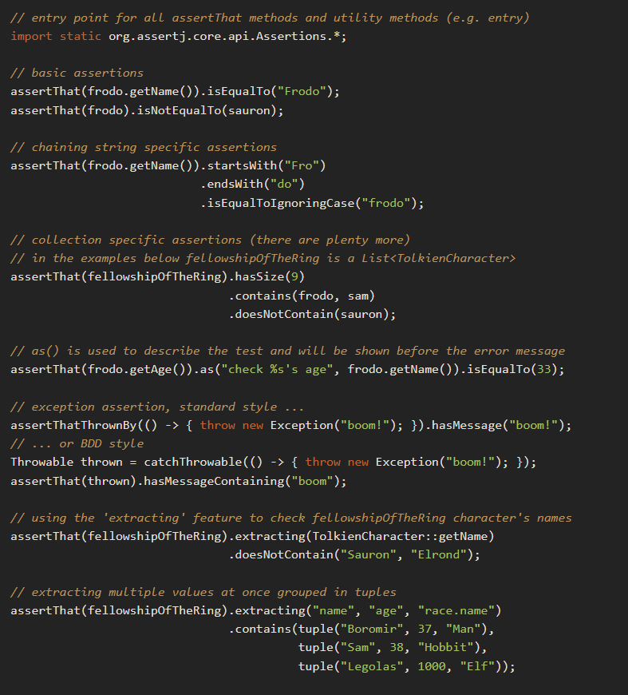
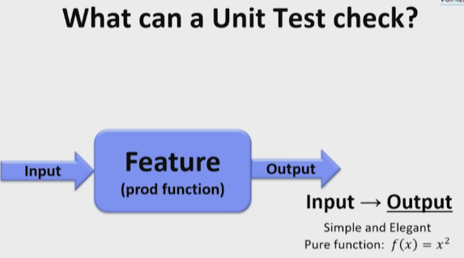
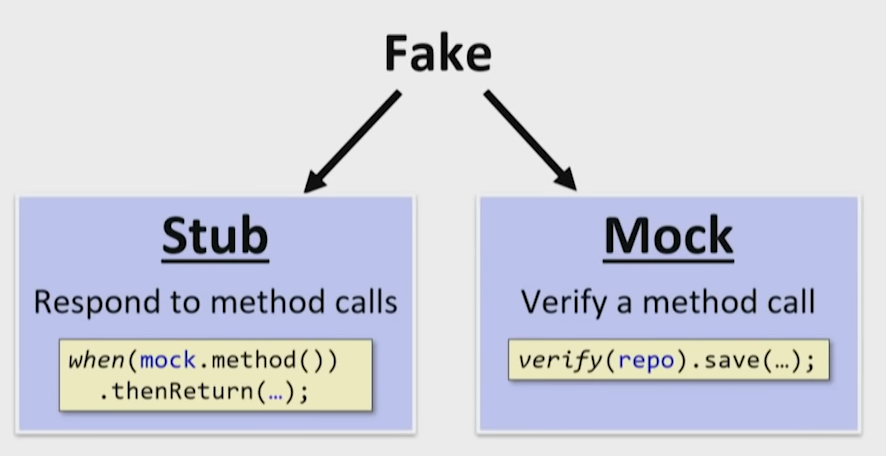
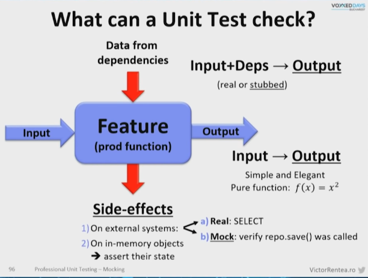
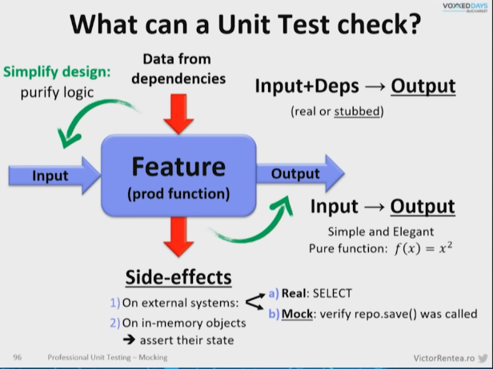
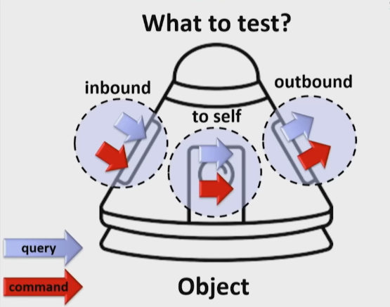
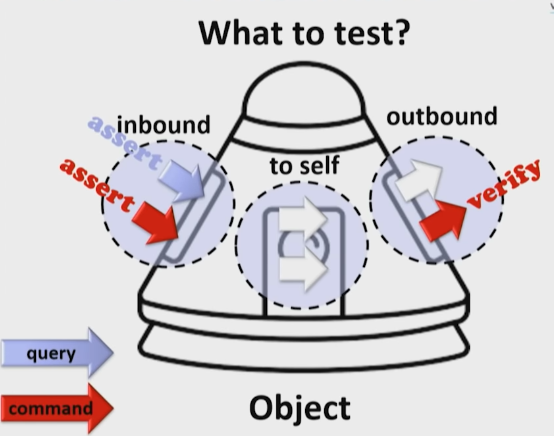

## Assertions
1. Konzept: 
   - Behauptung aufstellen, dass ein Objekt in einem bestimmten Zustand ist
   - Wenn die Behauptung nicht zutrifft, wirf eine Exception
2. Gedacht für Tests, aber nicht exklusiv für Tests

### Basic Assertions

#### assert

```java
import org.springframework.util.Assert;

import java.util.Objects;


class AssertTest
{
   @Test
   void test()
   {
      // given
      String in = null;

      // asserts
      assert in != null; // throws java.lang.AssertionError

      org.junit.jupiter.api.Assertions.assertNotNull(in); // throws org.opentest4j.AssertionFailedError: expected: not <null>

      Objects.requireNonNull(in); // throws java.lang.NullPointerException

      org.springframework.util.Assert.notNull(in, "Objekt war null");   // throws IllegalArgumentException
   }
}
```

### AssertJ (https://assertj.github.io/doc/)
- "Fluent" Assertions
- bessere Test-Lesbarkeit
- bessere Failure-Messages 
- einfach zu benutzen

#### String-Asserts
```java
String in = "Hans ist froh"; 
        
assertThat(in).isNotBlank()
        .contains("ist")
        .startsWith("Hans")
        .doesNotEndWith("traurig")
        .isEqualTo("Hans ist froh");
```

#### Collection-Asserts
```java
record LordOfTheRingCharacter(String name, Race race, int age);

List<LordOfTheRingCharacter> fellowshipOfTheRing = ...;

assertThat(fellowshipOfTheRing).hasSize(9)
                               .contains(frodo, sam)
                               .doesNotContain(sauron);
```

#### DateTime-Asserts

```java
LocalDate tomorrow = LocalDate.now().plusDays(1);

assertThat(tomorrow).isAfter(LocalDate.now());
```

#### Exception-Asserts
```java
assertThatExceptionOfType(VerarbeitungsException.class)
                .isThrownBy( () -> benutzerService.anmelden("juergen", "1234"))
                .withMessage("Passwort nicht korrekt");
```



#### Rückgabe-Werte einer Methode testen
```java

```

- Bei "pure-functions" sehr einfach -> nur Asserts auf Rückgabewerte
- Bei anderen Methoden mit Seiteneffekten -> schwieriger, da Mocks verwendet werden müssen


## Mocks + Mockito
- "Dummy-Objekte" -> Konfigurierbare Objekte, die für einen bestimmten Methodenaufruf etwas tun oder zurückgeben
- "Stubbed" Methoden haben Default-Rückgabe-Werte


- Mockito bildet beides ab


### Mocks


Über Annotationen
```java
class RatenplanServiceTest
{

   @InjectMocks
   private RatenplanService ratenplanService;

   @Mock
   private RatenplanRepository ratenplanRepository;

   @BeforeEach
   void init() 
   {
        MockitoAnnotations.openMocks(this);       
   }
   
   @Test
   void wenn_dann()
   {
      // given
      when(this.ratenplanRepository.findById(anyInt())).thenReturn(new Ratenplan(3));   // STUB
      
      // when
      this.ratenplanService.rpAnlegen(...);
      
      // then
      verify(this.ratenplanRepository.save(any(Ratenplan.class)));  // MOCK
   }
}
```

```java
class RatenplanServiceTest
{
    
   private RatenplanService ratenplanService;
   
   private RatenplanRepository ratenplanRepository;

   @BeforeEach
   void init() 
   {
      this.ratenplanRepository = Mockito.mock(RatenplanRepository.class);
      
      this.ratenplanService = new RatenplanService(this.ratenplanRepository);
   }
   
   @Test
   void wennRpAnlegen_dannAbgespeichertInDb()
   {
      // given
      when(this.ratenplanRepository.findById(anyInt())).thenReturn(new Ratenplan(3));   // STUB
      
      // when
      this.ratenplanService.rpAnlegen(...);
      
      // then
      verify(this.ratenplanRepository.save(any(Ratenplan.class)));  // MOCK
   }
}
```

### Vorschlag (To be discussed ...)
```java
class BaseUnitTest
{
   @BeforeEach
   void init()
   {
      MockitoAnnotations.openMocks(this);
   }
}

```

https://javadoc.io/doc/org.mockito/mockito-core/latest/org/mockito/Mockito.html






### Was soll ich testen?


### Vorschlag (To be discussed)







-> Beispiel an `UserRegistrationService`
